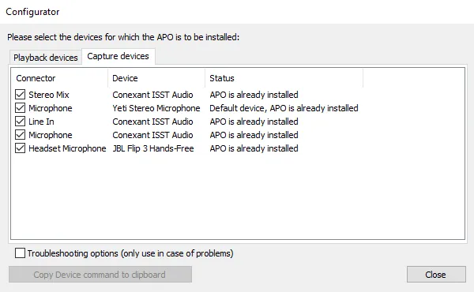

# Гайд по установке шумоподавителя на компьтер #opensource #free #anarchy

## Windows
вольный перевод [статьи с медиума](https://medium.com/@bssankaran/free-and-open-source-software-noise-cancelling-for-working-from-home-edb1b4e9764e), если чувствуете, что что-то непонятно, смело идите туда)

Сам процесс делится на 2 части:
1. Установка эквалайзера
2. Настройка vst плагина для шумоподавления

### Equalizer APO
1. Сначала переходим на сайт [equalizer apo](https://equalizerapo.com/download.html)

2. Скачиваем по ссылке, распаковываем архив и начинаем установку.
**Важно** Во время установки проверьте, что у вас не отмечены все поля в playback devices. Т.к. это включает шумоподавление входящих звуков, что может сослужить плохую службу (например вы не будете слышать людей с плохим микро)

3. Закончите установку и перезагрузите компьютер

### Noise cancellation plugin
1. Скачиваем последний релиз плагина [отсюда](https://github.com/werman/noise-suppression-for-voice/releases)
(выберите windows-rnnoise)
2. Копируем папку vst в подходящее место. Желательно, чтобы путь до папки был без кириллицы, если не проблема - в корень:-)

### Финальная настройка эквалайзера
1. Откройте Editor.exe из установочного каталога Equalizer APO (по умолчанию Program Files/EqualizerAPO).
2. Если во время установки эквалайзера на шаге 2 напартачили с девайсами, то открытое диалоговое окно поможет это исправить. Если все было и так хорошо, просто пропустите шаг.

3. Далее жмем на зеленый плюсик и выбираем Control => Devices

4. После нажимаем change, отжимаем "select all devices", выбираем микрофоны, которыми пользуемся.

5. Далее опять зеленый плюсик и выбираем Plugins => VST Plugin

6. Выбираем в окошке файл ...mono.dll который лежит в папке vst
7. Готово, вы великолепны! Для настройки можете включать и выключать по кнопке пава шумоподавление)

## Вместо заключения
Спасибо, что прочитали! Если есть вопросы/исправления/предожения пишите в телегу @ilyamkhv или делайте ПР. Работаем ради **НАШЕГО** **либертарного анархического трудового** народа